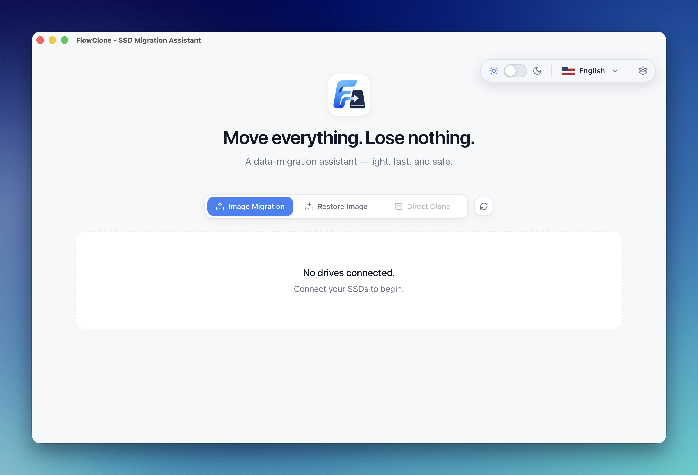

# FlowClone

[](https://github.com/Dhanabhon/flow-clone/releases/latest)

Move everything. Lose nothing.

FlowClone is a modern, open-source SSD migration assistant for macOS and Windows
(macOS-first). It is a Tauri desktop app with a React interface, English/Thai UI
support, and a Rust workspace behind it.

> **Tested on:** MacBook (Apple **M4 Max**), **macOS Tahoe 26.5.1**.



## Key features

- **Smart imaging that skips the empty space.** FlowClone reads only the blocks
  your filesystem is actually using — so a barely-filled 512 GB SSD becomes a
  ~50 GB image, not a 512 GB one. Quicker to capture, smaller to keep.
- **One-tap compression.** Shrink images even further with built-in zstd — a tiny
  `.flowimg` you can stash on any drive or in the cloud.
- **Exact when it matters.** Want a true bit-for-bit copy instead? Flip one switch
  from Smart to Exact for a full, faithful clone.
- **Upgrade your SSD in two moves.** Image the old drive, restore onto the new one
  — the painless way to jump from 256 GB to 512 GB and beyond.
- **Safety wired into the core.** Your source disk is never written to. Restores
  demand a typed `ERASE` and flat-out refuse boot, internal, read-only, and
  too-small targets — guardrails enforced in the Rust engine, not just the UI.
- **Built for the real world.** Loose cable? It reconnects and resumes. Bad
  sector? It skips and logs it instead of giving up. Power loss? The next launch
  flags the unfinished image so nothing silently breaks.
- **Never guess what's happening.** Live percentage, transfer speed, GB written,
  and ETA — plus a desktop notification the moment a job finishes.
- **Plug and go.** Drives pop in and out of the list the instant you connect or
  remove them, and you can safely eject straight from the card.
- **Your language, your theme.** English & ไทย, light & dark — switch anytime.
- **Light, native, and quick.** A ~7 MB Tauri + Rust download built for macOS
  (Apple Silicon & Intel) — no Electron bloat, no telemetry, no account.
- **Free and open source.** MIT-licensed — inspect it, build it, trust it.

## Disclaimer

> **Use FlowClone entirely at your own risk.** It performs low-level disk
> operations — reading raw devices and **erasing and overwriting entire disks**.
> A wrong disk choice, a failing drive, a flaky cable or enclosure, or an
> interrupted write can lead to **permanent data loss or a disk you can no longer
> use**.
>
> FlowClone is provided **"as is", without warranty of any kind**. The authors and
> contributors accept **no responsibility or liability for any data loss, file or
> filesystem corruption, drive or SSD failure, hardware damage, or any other loss**
> arising from using — or being unable to use — this software (see the
> [License](#license)).
>
> **Before you start:** keep a separate, verified backup of anything you can't
> afford to lose, and double-check the source and target disks every time.
> Choosing the correct drives is your responsibility.

## Safety warning

FlowClone can now create and restore raw disk images on macOS and Windows.

- **Image Migration** reads a source disk into a `.flowimg` file (read-only on
  the source).
- **Restore Image** writes a `.flowimg` back onto a target disk — **this is
  destructive and erases the target**.

Both need elevated raw-disk access:

- **macOS** — an admin prompt, plus **Full Disk Access** granted to the
  responsible app.
- **Windows** — a **UAC** prompt (Run as administrator). No separate Full Disk
  Access grant is needed. Restore locks and dismounts the target's volumes
  before writing; close anything using the target disk first.

**Direct Clone** is temporarily disabled in this release, and verification is
still stubbed.

## Features

### UI shell

- First-run onboarding that walks you through granting the access FlowClone
  needs (macOS Full Disk Access / Windows UAC).
- Switch between English and Thai.
- Persist the selected language locally.
- Switch between light and dark mode.
- Detect disks automatically as they are connected or removed (event-driven via
  the native DiskArbitration watcher), with a manual refresh available.
- Eject an external disk safely from its card before unplugging.

### Image Migration

- Detect the connected source SSD and show its real used space.
- Choose where to save the `.flowimg` image.
- Create a full raw image of the source disk. The privileged raw read runs
  through a native macOS admin prompt (or the `flowclone` CLI under `sudo`); the
  source is unmounted for the read and remounted afterward.
- Choose **Smart** (store only used blocks of an NTFS disk; falls back to a full
  copy otherwise) or **Exact** (full bit-for-bit copy), and optionally
  **Compress** the image — with a live size/time estimate.
- Show live progress, transfer speed, and estimated time; cancel at any time
  (with a confirmation prompt). A desktop notification fires when the job
  finishes, and closing the app mid-job asks for confirmation.
- Recover from interruptions: auto-reconnect and resume if the disk drops off
  the bus, skip unreadable blocks (ddrescue-style) so a bad sector doesn't abort
  the whole image, and flag an unfinished image on the next launch after a crash
  or power loss.

### Restore Image

- Choose a `.flowimg` file and a target SSD.
- Validate the image and the target (rejects boot, internal, read-only, and
  too-small disks).
- Require typed `ERASE` confirmation.
- Write the raw image onto the target via a macOS admin prompt (or the
  `flowclone` CLI with `--confirm-erase`), with live progress, speed, and ETA.
- **Destructive — the target disk is erased and overwritten.**

### Direct Clone (coming soon)

Disk-to-disk cloning is temporarily disabled in this release while Image
Migration and Restore are stabilized. The mode is visible but inactive (it shows
a "coming soon" tooltip) and will return in a later version.

## Tech stack

- Tauri v2
- React
- TypeScript
- Vite
- Tailwind CSS
- shadcn/ui-style primitives
- Framer Motion
- Lucide Icons
- Zustand
- Rust workspace

## Repository layout

```text
flowclone/
  apps/
    desktop/
  crates/
    flowclone-core/
    flowclone-disk/
    flowclone-raw/
    flowclone-verify/
    flowclone-report/
    flowclone-cli/
  docs/
  assets/
  scripts/
```

## Development setup

```bash
pnpm install
pnpm dev
pnpm typecheck
pnpm lint
pnpm build
pnpm test
FLOWCLONE_DISK_BACKEND=mock pnpm dev
cargo run -p flowclone-cli -- list-disks
```

Use `FLOWCLONE_DISK_BACKEND=mock FLOWCLONE_MOCK_DISKS=one pnpm dev` to test the
Image Migration path.

For local raw image testing on macOS, build the CLI and run only the CLI with
admin rights:

```bash
cargo build -p flowclone-cli
sudo ./target/debug/flowclone create-image --source /dev/disk6 --output ~/Downloads/FlowClone-test.flowimg
```

Pass `--compress` to `create-image` to write a smaller zstd-compressed `.flowimg`
(v2 format); `restore-image` auto-detects and decompresses it, and still restores
older uncompressed images. Pass `--used-only` to read and store only the
allocated blocks of an NTFS disk (much faster and smaller on a mostly-empty
disk); it falls back to a full image if the disk isn't GPT/NTFS. The two flags
combine. The GUI exposes both via the Image Migration **Smart / Exact** toggle
and **Compress** switch. See `docs/SPARSE_IMAGE.md`.

Do not run the desktop GUI as root.

Creating an image from the GUI triggers a macOS admin prompt for the raw read.
That elevated read also needs **Full Disk Access** for the responsible app —
grant it under System Settings → Privacy & Security → Full Disk Access. In
development, grant it to the terminal that launches `pnpm dev` (the dev app
inherits its access). The GUI runs the same `flowclone` CLI, so build it first
with `cargo build -p flowclone-cli`.

## Build desktop installers

Run `pnpm install` before any build command. `pnpm tauri build` runs the
frontend build (`tsc -b && vite build`) automatically. Release artifacts are
generated by Tauri under `target/**/release/bundle/`.

**Bundle the CLI sidecar first.** Image Migration and Restore run the
`flowclone` CLI for the privileged raw I/O, bundled into the app as a Tauri
sidecar. Build it for the **same target** you pass to `tauri build`, otherwise
the app launches but those workflows fail with *"FlowClone CLI not found"*:

```bash
pnpm sidecar                                   # host arch
# or a specific target:
bash scripts/build-sidecar.sh aarch64-apple-darwin
bash scripts/build-sidecar.sh universal-apple-darwin   # fat binary via lipo
```

### macOS Apple Silicon `.app`

Use this for M-series Macs:

```bash
bash scripts/build-sidecar.sh aarch64-apple-darwin
pnpm tauri build --target aarch64-apple-darwin --bundles app,dmg
```

Expected output:

```text
target/aarch64-apple-darwin/release/bundle/macos/FlowClone.app
```

### macOS Intel `.app`

Use this for Intel Macs:

```bash
bash scripts/build-sidecar.sh x86_64-apple-darwin
pnpm tauri build --target x86_64-apple-darwin --bundles app,dmg
```

Expected output:

```text
target/x86_64-apple-darwin/release/bundle/macos/FlowClone.app
```

### macOS universal `.app`

Use this when one `.app` must run on both Apple Silicon and Intel Macs:

```bash
bash scripts/build-sidecar.sh universal-apple-darwin
pnpm tauri build --target universal-apple-darwin --bundles app,dmg
```

Expected output:

```text
target/universal-apple-darwin/release/bundle/macos/FlowClone.app
```

To create a DMG on macOS, use `--bundles app,dmg` instead of `--bundles app`.
Unsigned builds may require right-clicking the app and choosing Open.
Production distribution still needs Apple Developer signing and notarization.

After installing the built app:

- Grant it **Full Disk Access** (System Settings → Privacy & Security → Full Disk
  Access) so it can read/write raw disks and read images from protected folders
  like Downloads.
- The `.flowimg` document icon only appears once the app is registered with
  Launch Services — move it to `/Applications` (or run `lsregister -f
  FlowClone.app`) and restart Finder.

### Windows `.exe`

Build Windows installers on a Windows machine or Windows CI runner. Cross-building
the Windows `.exe` from macOS is not the supported path for this project.

Prerequisites:

- Node.js 20+
- pnpm
- Rust stable with the MSVC toolchain
- Visual Studio Build Tools with Desktop development with C++
- WebView2 Runtime for machines that do not already include it

Build the CLI sidecar (the bash script is macOS-only, so do it manually), then
the NSIS `.exe` installer:

```powershell
pnpm install
rustup target add x86_64-pc-windows-msvc
cargo build -p flowclone-cli --release --target x86_64-pc-windows-msvc
New-Item -Force -ItemType Directory apps\desktop\src-tauri\binaries | Out-Null
Copy-Item target\x86_64-pc-windows-msvc\release\flowclone.exe `
  apps\desktop\src-tauri\binaries\flowclone-x86_64-pc-windows-msvc.exe
pnpm tauri build --bundles nsis
```

Expected output:

```text
target\release\bundle\nsis\FlowClone_0.3.7_x64-setup.exe
```

If the Windows host is not x64, install the target explicitly and pass it:

```powershell
rustup target add x86_64-pc-windows-msvc
pnpm tauri build --target x86_64-pc-windows-msvc --bundles nsis
```

Unsigned Windows builds may trigger SmartScreen warnings. Production
distribution needs Windows code signing.

## Docs

- [User Guide (web)](https://dhanabhon.github.io/flow-clone/) — online guide with screenshots
- [`docs/USER_GUIDE.md`](docs/USER_GUIDE.md) — how to install and use FlowClone
- [`CHANGELOG.md`](CHANGELOG.md)
- [`docs/DESIGN.md`](docs/DESIGN.md)
- [`docs/SPARSE_IMAGE.md`](docs/SPARSE_IMAGE.md) — the `.flowimg` v2 / sparse-image design
- [`docs/ARCHITECTURE.md`](docs/ARCHITECTURE.md)
- [`docs/SAFETY.md`](docs/SAFETY.md)
- [`docs/ROADMAP.md`](docs/ROADMAP.md)

## License

MIT. Treat this as a placeholder until the project governance is finalized.
